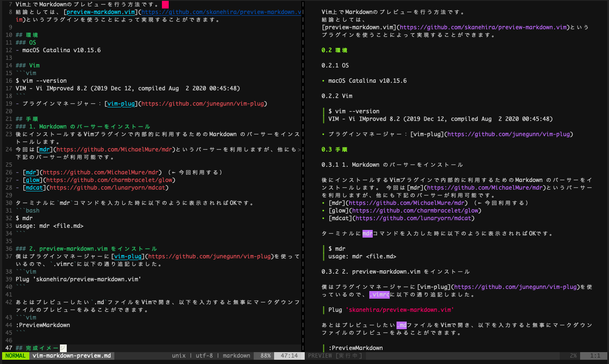

Vim上でMarkdownのプレビューを行う方法です。  
結論としては、[preview-markdown.vim](https://github.com/skanehira/preview-markdown.vim)というプラグインを使うことによって実現することができます。

## 環境
### OS
- macOS Catalina v10.15.6

### Vim
```vim
$ vim --version
VIM - Vi IMproved 8.2 (2019 Dec 12, compiled Aug  2 2020 00:45:48)
```
- プラグインマネージャー：[vim-plug](https://github.com/junegunn/vim-plug)

## 完成イメージ
最終的な完成イメージはこんな感じです。



## 手順
### 1. Markdown のパーサーをインストール
後にインストールするVimプラグインで内部的に利用するためのMarkdown のパーサーをインストールします。
今回は[mdr](https://github.com/MichaelMure/mdr)というパーサーを利用しますが、他にも下記のパーサーが利用可能です。

- [mdr](https://github.com/MichaelMure/mdr) （← 今回利用する）
- [glow](https://github.com/charmbracelet/glow)
- [mdcat](https://github.com/lunaryorn/mdcat)

ターミナルに`mdr`コマンドを入力した時に以下のように表示されればOKです。
```bash
$ mdr
usage: mdr <file.md>
```

mdr のインストール方法の詳細は、以降の「つまづきポイント」にて紹介しています。

### 2. preview-markdown.vim をインストール
僕はプラグインマネージャーに[vim-plug](https://github.com/junegunn/vim-plug)を使っているので、`.vimrc`に以下の通り追記しました。
```vim
Plug 'skanehira/preview-markdown.vim'
```

あとはプレビューしたい`.md`ファイルをVimで開き、以下を入力すると無事にマークダウンファイルのプレビューをみることができます。
```vim
:PreviewMarkdown
```

必要に応じて、以下の値を .vimrc に設定しておくと良いです。

- `g:preview_markdown_vertical` : プレビュー画面を垂直に分割して開きたい場合は1に設定する
- `g:preview_markdown_parser` : mdr 以外のマークダウンパーサーを指定する場合
- `g:preview_markdown_auto_update` : プレビュー画面のホットリロードをしたい場合は1に設定する

```vim
" skanehira/preview-markdown.vim用の設定値
let g:preview_markdown_vertical = 1
let g:preview_markdown_auto_update = 1
```

## つまずきポイント
最後に個人的につまずきポイントだったところを3つ紹介します。

- `mdr` をどうやってインストールすればいいのか
- `mdr` コマンド実行時に「開発元を検証できないため開けません」というメッセージが表示される
- マークダウンのプレビュー画面が右ではなく左に表示されてしまう

### 1. `mdr` をどうやってインストールすればいいのか
[preview-markdown.vim](https://github.com/skanehira/preview-markdown.vim)のREADMEには、
Requirements としてマークダウンパーサーが書かれてはいるのですが、
実際にどのようにそれをインストールしたらいいのか、までは書かれておりません。

そこで、マークダウンのパーサーである[mdr](https://github.com/MichaelMure/mdr)をインストールするために、
mdr の方の README を覗いてみると、
> You can grab a [pre-compiled binary](https://github.com/MichaelMure/mdr/releases/tag/v0.2.5).

と書いてあり、色々あるバイナリファイルから適切なものをダウンロードしてねとしか書かれておらず、少々困惑。

それを解決してくれたのが、[コチラ](https://okomehadaiji.com/vim%E3%81%A7-markdown%E3%83%95%E3%82%A1%E3%82%A4%E3%83%AB%E3%82%92%E3%83%97%E3%83%AC%E3%83%93%E3%83%A5%E3%83%BC%E3%81%97%E3%81%9F%E3%81%84%EF%BC%81)の記事でした。

簡単にまとめると、
1. 以下のコマンドを叩いて、自PCのカーネルのタイプを出力
```bash
$ uname -a
Darwin Kernel Version 19.6.0 (中略) x86_64
```

2. 適したバイナリをダウンロード  
`mdr_darwin_amd64` をダウンロードします。

3. ダウンロードしてきたバイナリに対してパスを通す
```bash
# バイナリファイルをダウンロードした先に移動する
$ cd { ダウンロードフォルダ }
# バイナリファイルに対して実行権限を付与する
$ chmod +x ./mdr_darwin_amd64
# バイナリファイルをパスが通っているフォルダへ移動する
$ sudo mv ./mdr_darwin_amd64 /usr/local/bin/mdr
# 【参考】パスが通っているフォルダの確認方法
$ echo $PATH
```

### 2. `mdr` コマンド実行時に「開発元を検証できないため開けません」というメッセージが表示される
上の1番が完了し、「これで `mdr` コマンドが使えるようになった！」と思いきや、さらなる関門がありました。
ターミナル上で、
```bash
$ mdr
```
と実行すると、「開発元を検証できないため開けません」というポップアップウィンドウが表示されてしまいます...。
これについてまた調べていると、[コチラ](https://sp7pc.com/apple/mac/5734)の記事を見つけました。

どうやら、Macではセキュリティ保護のため、なんでもかんでもダウンロードしてきたファイルを実行することはできないようになっているようです。

とはいえ、今回はダウンロードしてきたバイナリを実行する必要があるので、
実行許可を与えるために、以下のコマンドをターミナル上で実行します。

```bash
# ダウンロードしたすべてのアプリケーションを許可する
$ sudo spctl --master-disable
```

※ただこのコマンドは、書いてあるとおり、ダウンロードした全てのアプリケーションに対して実行許可を与えてしまうため、
同時にセキュリティリスクも伴うので、実行する際は慎重に活用されたい。

これで、晴れてターミナル上で `mdr` コマンドを実行できるようになりました。


### 3. マークダウンのプレビュー画面が右ではなく左に表示されてしまう
3つ目のつまずきポイントは、「マークダウンのプレビュー画面が右ではなく左に表示されてしまう」ところです。
これは好みかもしれませんが、僕個人的には、

- 左側：編集中のmdファイル
- 右側：プレビュー画面

が見やすいだろうなあと思っていたのですが、
`:PreviewMarkdown` で開かれるプレビューはいつも左側になってしまいます。

プレビュー画面を表示させるたびに、 `Ctrl-w` `R` で画面を入れ替えればいい話ですが、それも毎回やるのは面倒ですよね。

なので、調べてみたところ解決方法が見つかりました。

vim はデフォルトの動作で、新しいウィンドウを開くときは上か左に開かれるようです。

なので結論としては、 .vimrc に以下を追加するだけです。

```vim
" 新しいウィンドウを右に開く
set splitright
```

これでプレビュー画面が右側に表示されるようになりました。

## おまけ
マークダウンのプレビューをするために、毎回 `:PreviewMarkdown` なんて打つのは大変なので、
キーマップを設定しておくと非常に楽です。

ちなみに僕は以下の通り、 `<Leader>md` (`<Leader>`はSpaceキー) に設定しています。
```vim
" Markdownプレビュー
nnoremap <Leader>md :PreviewMarkdown<CR>
```

## 参考
- [preview-markdown.vim](https://github.com/skanehira/preview-markdown.vim)
- [VimでMarkdownファイルをプレビューしたい！](https://okomehadaiji.com/vim%E3%81%A7-markdown%E3%83%95%E3%82%A1%E3%82%A4%E3%83%AB%E3%82%92%E3%83%97%E3%83%AC%E3%83%93%E3%83%A5%E3%83%BC%E3%81%97%E3%81%9F%E3%81%84%EF%BC%81)
- [Mac「開発元を検証できないため開けません」を解決する方法! App Storeからダウンロードされないアプリを実行しよう](https://sp7pc.com/apple/mac/5734)
- [ウィンドウを開く方向を指定する](https://vim-jp.org/vim-users-jp/2011/01/31/Hack-198.html)
